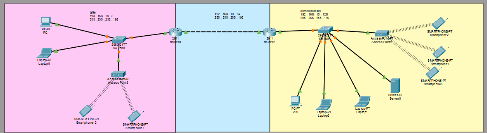

# TFI Redes de Información — Red de dos áreas con Packet Tracer y Windows Server

Trabajo Final Integrador de **Redes de Información** (UTN FRT). Diseño e implementación de una red corporativa de dos áreas (Administración y Taller) unidas por un enlace punto a punto: la topología y el ruteo se simularon en **Cisco Packet Tracer**, y los servicios (Active Directory, DHCP, GPO, IIS) corren en un **Windows Server 2022** virtualizado en VMware, con monitoreo en **PRTG** y análisis de tráfico con **Wireshark**.

## Contenido del repositorio

| Archivo | Descripción |
|---|---|
| `TFI-Redes.pkt` | Topología de Packet Tracer (routers, switches, access points, dispositivos finales) |
| `TFI-Redes-Informe.pdf` | Informe completo con capturas, justificación del diseño y análisis |

> El `.pkt` contiene solo la topología y el ruteo. Los servicios de Windows Server (AD, DHCP, GPO, IIS, PRTG) están documentados en el informe.

## Topología



Dos routers (Router0 para el Taller y Router2 para Administración) conectados por un enlace punto a punto. Cada área tiene un switch, un access point y sus dispositivos finales. El servidor está en Administración.

## Direccionamiento

Subnetting sobre `192.168.10.0/24`, en cuatro subredes `/26` (máscara `255.255.255.192`):

| Subred | Red | Rango utilizable | Broadcast | Uso |
|---|---|---|---|---|
| 0 | `192.168.10.0/26` | `.1` – `.62` | `.63` | LAN Taller |
| 1 | `192.168.10.64/26` | `.65` – `.126` | `.127` | Enlace punto a punto entre routers |
| 2 | `192.168.10.128/26` | `.129` – `.190` | `.191` | LAN Administración |
| 3 | `192.168.10.192/26` | `.193` – `.254` | `.255` | Reserva para expansión |

| Dispositivo | Interfaz | IP |
|---|---|---|
| Router0 (Taller) | Gi0/1 (gateway Taller) | `192.168.10.1` |
| Router0 (Taller) | Gi0/0 (enlace) | `192.168.10.65` |
| Router2 (Administración) | Gi0/0 (enlace) | `192.168.10.66` |
| Router2 (Administración) | Gi0/1 (gateway Administración) | `192.168.10.129` |
| Windows Server | Ethernet0 | `192.168.10.130` |

## Qué se implementó

**Red (Packet Tracer)**
- Direccionamiento IPv4 con subnetting y configuración de interfaces en los routers.
- Ruteo estático entre las dos áreas a través del enlace punto a punto.
- `ip helper-address` en el router del Taller para que los clientes obtengan IP del servidor DHCP ubicado en Administración.
- Pruebas de conectividad extremo a extremo (ping y modo simulación).

**Servidor (Windows Server 2022 en VMware)**
- Active Directory Domain Services con el dominio `tfi2026.local`.
- OU `TFI2026`, 5 usuarios y 2 grupos de seguridad (`Administracion` y `Taller`).
- Equipo cliente unido al dominio.
- Carpetas compartidas con permisos NTFS diferenciados por grupo (el grupo Taller no accede a la información de Administración).
- GPO vinculada a la OU que bloquea el acceso al Panel de control y a la Configuración de la PC.
- Servidor DHCP con dos ámbitos (`red_admin` y `red_taller`).
- IIS como servicio adicional, con una intranet en HTML.

**Monitoreo y análisis**
- Wireshark: capturas de ICMP, HTTP, ARP y TCP (SMB al copiar un archivo a la carpeta compartida).
- PRTG Network Monitor: sensor de ping y simulación de caída del servidor con alarmas.

**Parte física**
- Router Huawei HG8245U configurado como gateway de Administración (`192.168.10.129/26`) con su DHCP desactivado, de modo que el servidor Windows entrega las IP a los dispositivos reales (celular, notebook).

## Configuración de los routers

**Router0 (Taller)**
```
interface GigabitEthernet0/1
 ip address 192.168.10.1 255.255.255.192
 ip helper-address 192.168.10.130
 no shutdown
!
interface GigabitEthernet0/0
 ip address 192.168.10.65 255.255.255.192
 no shutdown
!
ip route 192.168.10.128 255.255.255.192 192.168.10.66
```

**Router2 (Administración)**
```
interface GigabitEthernet0/0
 ip address 192.168.10.66 255.255.255.192
 no shutdown
!
interface GigabitEthernet0/1
 ip address 192.168.10.129 255.255.255.192
 no shutdown
!
ip route 192.168.10.0 255.255.255.192 192.168.10.65
```

## Pruebas realizadas

- Ping desde la PC del Taller al servidor (`192.168.10.130`): 4 enviados, 4 recibidos, 0% de pérdida.
- Clientes del Taller y de Administración obtienen IP por DHCP desde el servidor (en el Taller, a través del relay).
- Acceso a la intranet (`http://192.168.10.130`) desde Packet Tracer y desde un celular real.
- Capturas de tráfico en Wireshark y alarmas en PRTG.

## Limitaciones y mejoras posibles

- **Punto único de fallo:** un solo servidor concentra AD, DNS, DHCP, archivos y web.
- **Sin redundancia** de enlaces ni de switches.
- **Sin VLANs ni ACLs:** la separación entre áreas es solo por subred y router.
- **Seguridad del servidor:** firewall desactivado y contraseñas de usuarios configuradas para no expirar (aceptable en laboratorio, no en producción).
- Posibles siguientes pasos: VLANs con ruteo inter-VLAN, ACLs entre áreas, OSPF y NAT, port security, acceso por SSH, segundo controlador de dominio y automatización de las configuraciones con Python.

## Autores

- Nadia Rizo Avalos
- Facundo Salas Vallejos
- Luciano Agustín Donnet

Trabajo realizado para la cátedra Redes de Información, Universidad Tecnológica Nacional — Facultad Regional Tucumán.
